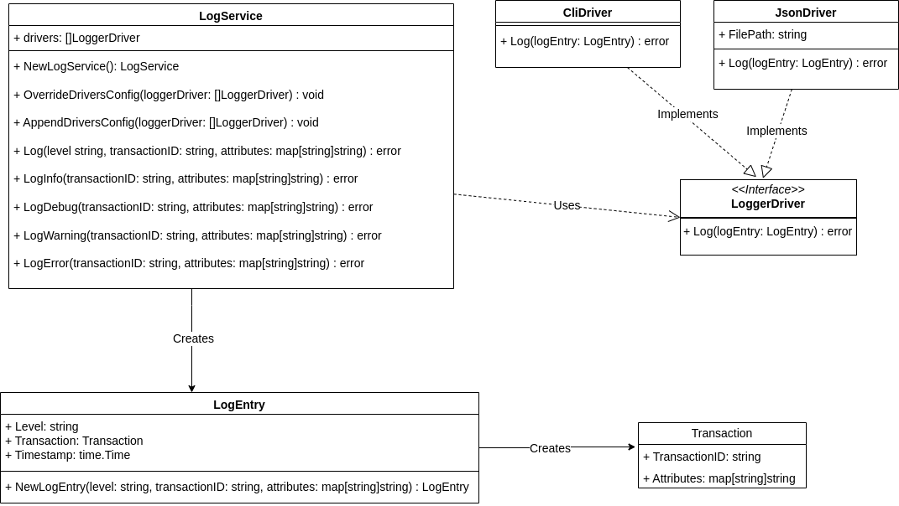

# Plentysystems Challenge

# Introduction
The challenge is implemented in 2 projects
1. `telemetry` which is the main service that takes the transaction and log it.
  - The service is configured to use default logger drivers which are `CLI` and `JSON`.
  - The new drivers can be appended to the default drivers or override them
  - The service is independent and can be imported and used whenever needed in command, API, or others.
2. `command` is a sample project that shows how can the telemetry service be used through a command


# Structure
- `go v1.23`
- docker image `golang:1.23` a docker container with the name `telemetry-app`.

# Installation

## Prerequisites
- Install [docker](https://docs.docker.com/engine/install/).
- Install [docker-composer](https://docs.docker.com/compose/install/).

## Installation commands
- After cloning the project go to the project root directory `plentysystems-challenge` in the terminal.
- Run `docker-compose up --build`
- Run the below command to access the bash of the container.
  `docker exec -it telemetry-app bash`
- The directory inside the container contains the 2 projects directories `command` and `telemetry`
- Run the test below command inside each project
```
cd command
go test ./... -v
```
or
```
cd telemetry
go test ./... -v
```

# Command Project
## Usage
- Run the below command to access the bash of the container.

  `docker exec -it telemetry-app bash`
- Enter the command directory

`cd command`
- To log a transaction, use the following command.

`./telemetry log --transaction-id <transaction-id> --attribute key=value --log-level <info|debug|warning|error>`

Example:

`./telemetry log --transaction-id "12345" --attribute origin=http --attribute customerId=123 --log-level info`
- By default logs should be added in `cli` and in the file `command/logs/app.json`

## Implementation
- The command is implemented to add a new logging driver, `FileDriver`, to log the transaction in a text file.
- Whenever needed to add or override the longer drivers the below command must be run in the `command` project to build the new command logic

`go build -o telemetry`

# Telemetry Service
## Usage
- Import the telemetry service in your project
- Initialize the `LogService` as below

`logService := service.NewLogService()`
- depending on the `loglevel` call the write log method from below
```
logService.LogInfo(transactionID, attributes)
logService.LogDebug(transactionID, attributes)
logService.LogWarning(transactionID, attributes)
logService.LogError(transactionID, attributes)
```
or you can call the below method and pass the log your self

`logService.Log(level, transactionID, attributes)`

## Adding New Logging Drivers
New logging drivers can be added to the used telemetry service by following these steps:

1. Create a New Driver: Implement the `LoggerDriver` interface that is defined in the `drivers` package in the telemetry service, which requires a Log(logEntry LogEntry) error method.
Example:
```
type MyCustomDriver struct{}

func NewMyCustomDriver() LoggerDriver {
    return &MyCustomDriver{}
}

func (d *MyCustomDriver) Log(logEntry LogEntry) error {
    // Custom logging implementation
    return nil
}
```
2. Integrate the new driver: In your LogService, use AppendDriversConfig or OverrideDriversConfig to add your custom driver.
```
myDriver := NewMyCustomDriver()
logService.AppendDriversConfig(myDriver)
```
## Other Ideas
1. Handle add config.yaml in that allowes changing log filepath for example
2. Allow to enable/disable one of the default config
## UML diagram
